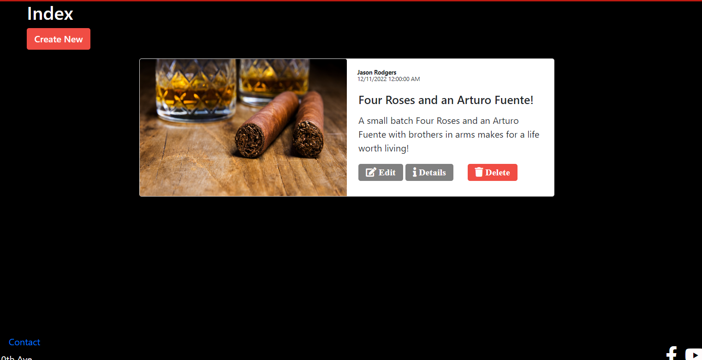

# Live Project #2
## Introduction
I recently did my second live project with the Tech Academy for the Software Developer Bootcamp. I was given the opportunity to do a two week sprint with a team of instructors and peers. This project was built using the ASP .NET MVC and Entity Framework. This was my second opportunity to work with a tech team in a profesional environment and I really enjoyed the experience. I was able to complete both [front end stories](#front-end-stories) and [back end stories](#back-end-stories) utilizing C# razor syntax, HTML, CSS, Javascript, JQUERY, AJAX and BOOTSTRAP as well as gaining experience in some valuable project management [skills](#other-skills-learned) that I'm sure will come in handy in the future. Below are a few of the stories I completed during this project.

## Front End Stories
  - [Style CRUD Create and Edit Pages](#style-crud-create-and-edit-pages)
  - [Style CRUD Index Page](#style-crud-index-page)

### Style CRUD Create and Edit Pages
For this story I had to create and style the CRUD Create and Edit pages for a theatre companies blogging section. These pages allow blog writers to create new and interesting content to put on display for patrons of their company.


```
.BlogPosts-Create--submitBtn {
    min-width: 110px;
    border-radius: 12px;
    background-color: var(--secondary-color);
    transition: transform .5s;
    margin: 0;
    position: absolute;
    top: 0%;
    margin-left: 125px;
    -ms-transform: translate(-50% -50%);
    transform: translate(-50% -50%);
}

.BlogPosts-Create--submitBtn:hover {
    transform: scale(0.95);
}

.BlogPosts-Create--backtolistBtn {
    min-width: 110px;
    border-radius: 12px;
    background-color: var(--main-color--light);
    transition: transform .5s;
    margin: 0;
    position: absolute;
    top: 0%;
    margin-right: 300px;
    -ms-transform: translate(-50% -50%);
    transform: translate(-50% -50%);
}

.BlogPosts-Create--backtolistBtn a {
    text-decoration: none;
    color: var(--light-color);
    text-align: center;
}

.BlogPosts-Create--backtolistBtn:hover {
    transform: scale(0.95);
}

.BlogPosts-Create--inputs:focus {
    border: 4px solid var(--main-color--light);
    outline: none;
    box-shadow: none;
    background-color: antiquewhite;
}

.BlogPosts-Create--inputs {
    margin-right: auto;
    margin-left: auto;
}

.BlogPosts-Create--FormContainer {

    padding-bottom: 50px ;
    background-color: var(--secondary-color--dark); 
}

.BlogPosts-Create--btnContainer {
    display: flex;
    justify-content: space-around;
}

/*End BlogPosts Edit and Create Page Styling*/

```

### Style CRUD INDEX Page
For this story I was tasked with creating an index page that would display all created blogs in a sleak looking vertical card format.

```


```
Jump to: [Front End Stories](#front-end-stories), [Back End Stories](#back-end-stories), [Other Skills Learned](#other-skills-learned), [Page Top](#introduction)

## Back End Stories
  - [Details Page](#details-page)
  - [Connect to and Parse through API](#connect-to-and-parse-through-api)

### Details Page
For these stories I was tasked with displaying the description for items I had previosuly added to the database and then also being able to edit the data associted ith these items. These are functions I employed to render and enable editing features for the app.
```
# Story #4: Details page -----------------------------------------------------------------------------------------------


def sitcom_details(request, pk):
    sitcom = get_object_or_404(Sitcom, pk=pk)
    content = {'sitcom': sitcom}
    return render(request, 'Sitcoms/sitcoms_details.html', content)

# Story #5: Edit and Delete Functions ----------------------------------------------------------------------------------


def sitcom_update(request, pk):
    sitcom = get_object_or_404(Sitcom, pk=pk)
    form = SitcomForm(data=request.POST or None, instance=sitcom)
    if request.method == 'POST':
        if form.is_valid():
            form.save()
            return redirect('../../read')
    content = {'form': form, 'sitcom': sitcom}
    return render(request, 'Sitcoms/sitcoms_update.html', content)
```
### Connect to and Parse through API
For these two stories I had to find an API that I wanted to use, connect to it and parse through the correct data I wanted to display.

```
# Story #6-(API Pt 1): Connect to API ----------------------------------------------------------------------------------
# Story #7-(API Pt 2): Parse through JSON

def sitcom_api(request):
    url = "https://yahoo-weather5.p.rapidapi.com/weather"

    querystring = {"location": "longview,wa", "format": "json", "u": "f"}

    headers = {
        "X-RapidAPI-Key": "1ba8d27b19mshd71557ea88643ebp14a569jsnc81e62fac8f7",
        "X-RapidAPI-Host": "yahoo-weather5.p.rapidapi.com"
    }

    response = requests.request("GET", url, headers=headers, params=querystring)

    api_info = json.loads(response.text)
    temp_int = api_info["current_observation"]["condition"]["temperature"]
    current_temperature = str(api_info["current_observation"]["condition"]["temperature"]) + ' \N{DEGREE SIGN}F'
    content = {"current_temperature": current_temperature, "temp_int": temp_int}
    return render(request, 'Sitcoms/sitcoms_api.html', content)
```
Jump to: [Front End Stories](#front-end-stories), [Back End Stories](#back-end-stories), [Other Skills Learned](#other-skills-learned), [Page Top](#introduction)
## Other Skills Learned
 - Worked with a team and was able to glean from their work as well as interact with the leads when I hit a snag that I couldn't solve.
 - Learning and utilizing good version control practices through git bash and Pycharm. 
 	- This enabled me to revert to previous points in my project when needed as well debug without negatively influencing others hard work.
 - Due to being in this program while working another job and managing a side business, I was really able to hone my own time management skills which I feel is crucial to any professional career, especially in the tech industry.

Jump to: [Front End Stories](#front-end-stories), [Back End Stories](#back-end-stories), [Other Skills Learned](#other-skills-learned), [Page Top](#introduction)
