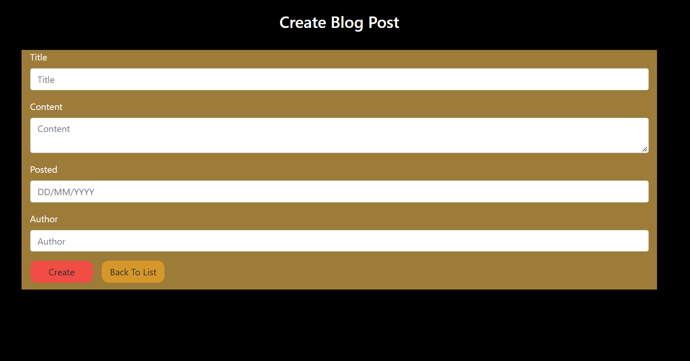

# Prosper I.T. Consulting Internship #2
## Introduction
I recently did my second live internship with Prosper I.T. Consulting. I was given the opportunity to do a two week sprint with a team of seasoned Devs and peers. This project was built using the ASP .NET MVC and Entity Framework. This was my second opportunity to work with a tech team in a professional environment and I really enjoyed the experience. I was able to complete both [front end stories](#front-end-stories) and [back end stories](#back-end-stories) utilizing C# razor syntax, HTML, CSS, JavaScript, JQUERY, AJAX and BOOTSTRAP as well as garnering [other skills](#other-skills-learned) in the area of team dynamics and good communication for a successful Dev team. Below are a few of the stories I completed during this project.

## Front End Stories
  - [Style CRUD Create and Edit Pages](#style-crud-create-and-edit-pages)
  - [Style CRUD Index Page](#style-crud-index-page)

### Style CRUD Create and Edit Pages
For this story I had to create and style the CRUD Create and Edit pages for a theatre companies blogging section. These pages allow blog writers to create new and interesting content to put on display for patrons of their company.


```
.BlogPosts-Create--submitBtn {
    min-width: 110px;
    border-radius: 12px;
    background-color: var(--secondary-color);
    transition: transform .5s;
    margin: 0;
    position: absolute;
    top: 0%;
    margin-left: 125px;
    -ms-transform: translate(-50% -50%);
    transform: translate(-50% -50%);
}

.BlogPosts-Create--submitBtn:hover {
    transform: scale(0.95);
}

.BlogPosts-Create--backtolistBtn {
    min-width: 110px;
    border-radius: 12px;
    background-color: var(--main-color--light);
    transition: transform .5s;
    margin: 0;
    position: absolute;
    top: 0%;
    margin-right: 300px;
    -ms-transform: translate(-50% -50%);
    transform: translate(-50% -50%);
}

.BlogPosts-Create--backtolistBtn a {
    text-decoration: none;
    color: var(--light-color);
    text-align: center;
}

.BlogPosts-Create--backtolistBtn:hover {
    transform: scale(0.95);
}

.BlogPosts-Create--inputs:focus {
    border: 4px solid var(--main-color--light);
    outline: none;
    box-shadow: none;
    background-color: antiquewhite;
}

.BlogPosts-Create--inputs {
    margin-right: auto;
    margin-left: auto;
}

.BlogPosts-Create--FormContainer {

    padding-bottom: 50px ;
    background-color: var(--secondary-color--dark); 
}

.BlogPosts-Create--btnContainer {
    display: flex;
    justify-content: space-around;
}

/*End BlogPosts Edit and Create Page Styling*/

```

### Style CRUD INDEX Page
For this story I was tasked with creating an index page that would display all created blogs in a sleak looking vertical card format utilizing font AWESOME icons and button animation.


```
/*BlogPosts Index Page Styling*/

.BlogPosts-Index--card {
    flex-direction: row;
}

.BlogPosts-Index--cardSpace {
    margin: 25px;
}

.BlogPosts-Index--cardImg {
    width: 50%;
}

.BlogPosts-Index--cardTextAuthor {
    font-weight: 700;
    font-size: 10px;
    margin: -4px;
    margin-left: -2px;
}

.BlogPosts-Index--cardTextPosted {
    font-size: 10px;
    margin-left: -2px;
  
}
.BlogPosts-Index--Btn {
    font-weight: 600;
    color: var(--light-color);
    background-color: grey;
}

.BlogPosts-Index--Btn:hover {
    background-color: dimgrey;
}

.BlogPosts-Index--creatNewBtn {
    font-weight: 600;
    color: var(--light-color);
    background-color: var(--main-color--light);
}

.BlogPosts-Index--creatNewBtn:hover {
    background-color: var(--main-color);     
}

.BlogPosts-Index--deleteBtn {
    font-weight: 600;
    color: var(--light-color);
    background-color: var(--main-color--light);
    margin-left: 20px;
}

.BlogPosts-Index--deleteBtn:hover {
    background-color: var(--main-color);
}

.BlogPosts-Index--bottomSpace {
    margin-bottom: -10px;
}

.BlogPosts-Index--deleteSuccessMsgContainer {
    background-color: black;
}

.BlogPosts-Index--deleteSuccessMsgBox {
    background-color: palegreen;
    border-radius: 25px;

}

.BlogPosts-Index--deleteSuccessMsg {
    color: darkgreen;
}

/*End BlogPosts Index Page Styling*/
```
Jump to: [Front End Stories](#front-end-stories), [Back End Stories](#back-end-stories), [Other Skills Learned](#other-skills-learned), [Page Top](#introduction)

## Back End Stories
  - [Model and CRUD Pages](#model-and-crud-pages)
  - [Create and Style Asynchronus Delete Modal](#create-and-style-asynchronus-delete-modal)
  
### Model and CRUD Pages
For this story I had to create the code fist model and CRUD pages.
```
{
    public class BlogPost
    {
        [Key]
        public int BlogPostID { get; set; }
        public string Title { get; set; }
        [DataType(DataType.MultilineText)]
        public string Content { get; set; }
        public DateTime Posted { get; set; }
        public string Author { get; set; }
    }
}

CRUD PAGES

 // GET: Blog/BlogPosts
 public ActionResult Index()
        {
            return View(db.BlogPosts.ToList());
        }

        // GET: Blog/BlogPosts/Details/5
        public ActionResult Details(int? id)
        {
            if (id == null)
            {
                return new HttpStatusCodeResult(HttpStatusCode.BadRequest);
            }
            BlogPost blogPost = db.BlogPosts.Find(id);
            if (blogPost == null)
            {
                return HttpNotFound();
            }
            return View(blogPost);
        }

        // GET: Blog/BlogPosts/Create
        public ActionResult Create()
        {
            return View();
        }

        // POST: Blog/BlogPosts/Create
        // To protect from overposting attacks, enable the specific properties you want to bind to, for 
        // more details see https://go.microsoft.com/fwlink/?LinkId=317598.
        [HttpPost]
        [ValidateAntiForgeryToken]
        public ActionResult Create([Bind(Include = "BlogPostID,Title,Content,Posted,Author")] BlogPost blogPost)
        {
            if (ModelState.IsValid)
            {
                db.BlogPosts.Add(blogPost);
                db.SaveChanges();
                return RedirectToAction("Index");
            }

            return View(blogPost);
        }

        // GET: Blog/BlogPosts/Edit/5
        public ActionResult Edit(int? id)
        {
            if (id == null)
            {
                return new HttpStatusCodeResult(HttpStatusCode.BadRequest);
            }
            BlogPost blogPost = db.BlogPosts.Find(id);
            if (blogPost == null)
            {
                return HttpNotFound();
            }
            return View(blogPost);
        }

        // POST: Blog/BlogPosts/Edit/5
        // To protect from overposting attacks, enable the specific properties you want to bind to, for 
        // more details see https://go.microsoft.com/fwlink/?LinkId=317598.
        [HttpPost]
        [ValidateAntiForgeryToken]
        public ActionResult Edit([Bind(Include = "BlogPostID,Title,Content,Posted,Author")] BlogPost blogPost)
        {
            if (ModelState.IsValid)
            {
                db.Entry(blogPost).State = EntityState.Modified;
                db.SaveChanges();
                return RedirectToAction("Index");
            }
            return View(blogPost);
        }

        // GET: Blog/BlogPosts/Delete/5
        public ActionResult Delete(int? id)
        {
            if (id == null)
            {
                return new HttpStatusCodeResult(HttpStatusCode.BadRequest);
            }
            BlogPost blogPost = db.BlogPosts.Find(id);
            if (blogPost == null)
            {
                return HttpNotFound();
            }
            return View(blogPost);
        }

```
### Create and Style Asynchronus Delete Modal
For this story I created a modal using Bootstrap as well as writing an JSONResult method in my controller that linked to a javascript method with AJAX allowing me to delete blogposts from both the database and update the front end Index page visual for the user.


```
CONTROLLER METHOD

[HttpPost]
        public JsonResult DeletePostAsync(int id)
        {
            BlogPost blogPost = db.BlogPosts.Find(id);
            var result = new JsonResult(); //saitsfies method requirements
            db.BlogPosts.Remove(blogPost); //removes records from database table
            db.SaveChanges();// saves changes
            return Json(result); //satisfies method requirements and returns back to javascript method 
        }

JAVASCRIPT AJAX

// this function gets a the unique id passed to, communicates with the controller through ajax and calls the DeletePostAsync JSONRESULT method
function DeleteBlogPost(id) {
    $.ajax({
        type: "POST",
        url: "/BlogPosts/DeletePostAsync", //sends unique id and calls controller method
        data: { id: id },
    })
        .done(function () { 
            $("#BlogPost-" + id).remove();//once this gets hit the post is removed from the users view
            $("#" + id).fadeIn(500).delay(3000).fadeOut(500); // targets div on index and fades in a message letting the user know a post has been successfully deleted and then fades out.
        
         })
}

```
Jump to: [Front End Stories](#front-end-stories), [Back End Stories](#back-end-stories), [Other Skills Learned](#other-skills-learned), [Page Top](#introduction)
## Other Skills Learned
 - Worked with a team and was able to glean from their work as well as interact with the leads when I hit a snag that I couldn't solve.
 - Learning and utilizing good version control practices through Visual Studio.
 	- This enabled me to update my team lead as well as refresh my database and the whole project when more current versions were added while working on the project.
 - Due to being in this program while working another job and managing a side business, I was really able to hone my own time management skills which I feel is crucial to any professional career, especially in the tech industry.

Jump to: [Front End Stories](#front-end-stories), [Back End Stories](#back-end-stories), [Other Skills Learned](#other-skills-learned), [Page Top](#introduction)
